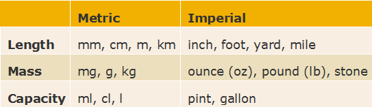
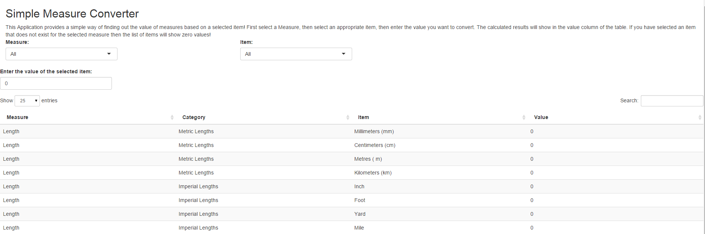

Measure Converter Pitch
========================================================
author: Dino Philaretou
date: Sat Jun 20 08:41:56 2015
width: 1440
height: 900

Converting between metric and imperial units
========================================================

I have always wanted to create an application that can easily convert the value of one measure to another, especially between metric and imperial measures.

This application does exactly that. 

### Note that due to time constraints I was not able to include the capacity measures. 
### In the future I will add this and other measures as time allows.

Common values available for Length and Mass:
========================================================

**Length**            | **Mass** 
-------------         | ------------- 
	1 cm = 10 mm        | 	1 g = 1000 mg        
	1 m = 100 cm        | 	1 kg = 2.2046 lb
	1 m = 39.37 inches  | 	1 kg = 1000 g
	1 inch = 2.54 cm    | 	1 oz = 28.3495 g
	1 foot = 30.5 cm    | 	1 stone = 6.35029 kg
	1 yard = 91.44 cm   | 	1 stone = 14 lb
	1 yard =  3 feet    | 	1 lb = 16 oz
	1 km = 1000 m       |   1 mg = 0.0000352739619496 oz
	1 km = 5/8 mile     |   1 g = 0.0352739619496 oz
	1 mile = 1760 yards |   1 kg = 0.157473044418 stone

Dropdowns and Data Entry Functionality - screenshot:
========================================================

#### There is a dropdown picklist to select a main category of measure.
### The table with measure items is automatically updated with the corresponding list.
### There is a dropdown picklist to select one measure, the measure to be converted.
### There is a textbox where the value of the measure can be entered.
### The table of measures is automatiocally updated with all the correctly converted values.
### If an item is selected that does not belong to the selected category, the first dropdown, then the values in the table will all be set to zero.

Conclusion:
========================================================

This is a great little application that can be easily enhanced to include many other measures. 
Convert from any measure to any other measures is a few clicks.

